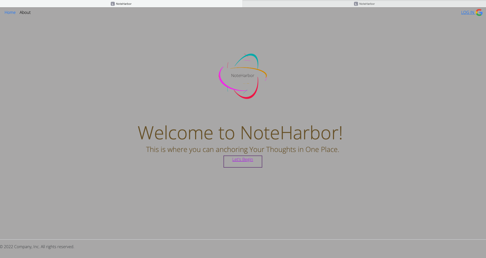

# NoteHarbor
----------

Welcome to my Note Taking App powered by Node.js!
At NoteHarbor, we're dedicated to providing you with a seamless and efficient note-taking experience. Our
app is built on the robust foundation of Node.js, ensuring a fast and reliable performance that keeps up with
your busy lifestyle.
Why choose our Note Taking App? 

Our app leverages the power of Node.js to deliver a responsive and dynamic note-taking
experience. Say goodbye to sluggish interfaces and hello to smooth interactions.

## Technologies Used
--------
* **Node JS**
* **Express**
* **MongoDB**
* **Passport**
* **CRUD**
* **OAuth**

## Getting Started
---------

Click [here](https://) to navigate to the app.

## Example
---------

## Next Steps
---------
1. Speech to text API
2. Search bar
